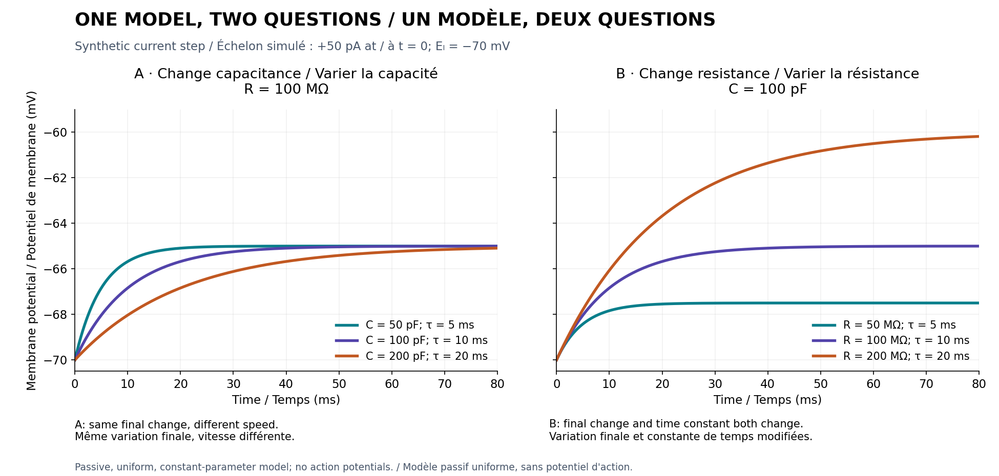

# 001 — Membrane passive : de la biologie à l'équation

Statut : sources contrôlées ; aucune validation indépendante par un enseignant. Prérequis : membrane et ions, courant et tension, équations différentielles du premier ordre. Exemple du format pédagogique, pas première étape du programme complet.

**Objectifs :** définir les variables ; vérifier les unités ; calculer une réponse à un échelon ; distinguer amplitude et vitesse ; expliquer les limites.

Dans une approximation électrique, la membrane sépare des charges et les canaux ioniques offrent des voies conductrices. Une cellule passive, supposée spatialement uniforme, est représentée par une capacité et une conductance de fuite. Cette approximation ne reproduit pas la génération active d'un potentiel d'action. [S1, S2]

Les courbes sont calculées, pas enregistrées. Un seul paramètre varie dans chaque panneau. Les valeurs sont pédagogiques, sans prétention à représenter tous les neurones.

Avec un courant injecté entrant défini comme positif :

$$C_m\frac{dV}{dt}=I_{\mathrm{inj}}-g_L(V-E_L).$$

| Symbole | Signification | Unité SI |
|---|---|---|
| $V$ | Potentiel intérieur moins potentiel extérieur | V |
| $C_m$ | Capacité totale de la cellule | F |
| $g_L$ | Conductance totale de fuite passive | S |
| $E_L$ | Potentiel d'inversion effectif de fuite ; potentiel de repos dans ce modèle sans injection | V |
| $I_{\mathrm{inj}}$ | Courant injecté, positif vers l'intérieur | A |

Les grandeurs sont totales, non rapportées à une surface. Conserver les mêmes conventions. Le bilan des courants et le terme de fuite suivent S1–S2.

Pour $I_0$ constant, $V(0)=E_L$ et $R_m=1/g_L$ :

$$V(t)=E_L+I_0R_m(1-e^{-t/\tau_m}),\qquad \tau_m=R_mC_m.$$

Exemple numérique original : $E_L=-70$ mV, $I_0=50$ pA, $R_m=100$ MΩ, $C_m=100$ pF.

$$I_0R_m=(50\times10^{-12})(100\times10^6)=0.005\ \mathrm{V}.$$

$$\tau_m=(100\times10^6)(100\times10^{-12})=0.01\ \mathrm{s}.$$

Donc $V_\infty=-65$ mV et $V(10\,\mathrm{ms})\approx-66.84$ mV. Vérifier par substitution plutôt que mémoriser ces nombres.

**Approfondissement mathématique :** poser $x=V-E_L$. Alors $C_m\dot{x}+g_Lx=I$. Pour une entrée sinusoïdale, la résolution donne l'impédance

$$Z(\omega)=\frac{1}{g_L+i\omega C_m}.$$

Son unité est l'ohm. Calculer module et phase ; expliquer les prédictions avant de coder.

**Limite biologique :** la conductance constante omet la dynamique des canaux dépendant du voltage. Ajouter un seuil de déclenchement serait un choix de modèle distinct, sans déduire la forme d'un potentiel d'action. Les modèles plus détaillés incluent explicitement des conductances ioniques. [S2]

Lire les [questions](questions.md) avant le [corrigé](solutions.md). Références : [S1–S3](../../sources/references.md). S3 est une lecture biologique complémentaire, pas la source de vérification de cette dérivation.
